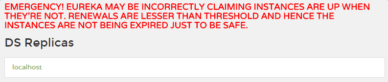

# Eureka  

## Eureka介绍

M：Eureka是什么？

Z：Eureka是SpringCloud服务的注册中心，作为轮询负载均衡器。服务注册在Eureka上，并维持心跳连接。

Eureka上三种角色：Eureka，Provider，Consumer

## 创建Eureka项目

M：Eureka怎么创建呢？

Z：新建Spring Initiallizr项目，选择idea自带的Cloud Discovery - Eureka Discovery，完成创建即可 

创建所包含的内容：

```
maven依赖：
    spring-cloud-starter
    spring-cloud-starter-eureka-server
    spring-boot-starter-test
```

M：怎么启动Eureka报错呢？

Z：需要在Application上添加注解``@EnableEurekaServer``。

Eureka自己也是个服务，需要注册自我才不会报错。在application.yml中添加以下代码

```yaml
server:
 port: 8761 # 8761是eureka server的默认端口

eureka:
# server:
#  enable-self-preservation: false #自我保护模式
 client:
  service-url:
   defaultZone: http://127.0.0.1:${server.port}/eureka/ #eureka server的应用注册地址
  register-with-eureka: false #Eureka注册到Eureka
  fetch-registry: false #获取注册表信息

spring:
 application:
  name: eureka-demo
```

(注意：yml冒号后面至少有一个空格)

M：自我保护模式``enable-self-preservation``有什么作用？

Z：当Eureka检测不到服务的心跳时，就会将该服务注销掉。但是万一问题不是出现在服务上，而且是出现在网络上时，健康的服务也会被注销掉。所以当短时间内注销多个服务时，Eureka就会怀疑是否是网络问题，这个时候就会进入自我保护模式，停止注销服务动作，并且出现红色文字警告

  

M：怎么通过命令行启动Eureka呢？

Z：将Eureka用package打包之后，用``java -jar``启动。

## Eureka集群   

M：怎么配置Eureka双结点呢？

Z：新建两个配置文件，配置文件1和配置文件2相互注册。使用不同的命令指明配置文件启动

如application-peer1.properties

```properties
spring.application.name=spring-cloud-eureka
server.port=8000
eureka.instance.hostname=peer1

eureka.client.serviceUrl.defaultZone=http://peer2:8001/eureka/
```

(peer1需要添加host才可以使用以上配置)

启动方式：

```
java -jar spring-cloud-eureka-two-0.0.1-SNAPSHOT.jar --spring.profiles.active=peer1
```

M：指向方式很奇怪，只需要指明哪一个后缀就可以了（即使该后缀

被修改过，旧的后缀仍然可以指向启动，原因不详。）

M：那如果是更多的结点呢？

Z：除了可以编写更多的配置文件，也可以在一个配置文件中写多个配置，启动的时候指定改配置启动

```yaml
---
spring:
  application:
    name: spring-cloud-eureka
  profiles: peer1
server:
  port: 8000
eureka:
  instance:
    hostname: peer1
  client:
    serviceUrl:
      defaultZone: http://peer2:8001/eureka/,http://peer3:8002/eureka/ #多节点使用逗号分隔
---
spring:
  application:
    name: spring-cloud-eureka
  profiles: peer2
server:
  port: 8001
eureka:
  instance:
    hostname: peer2
  client:
    serviceUrl:
      defaultZone: http://peer1:8000/eureka/,http://peer3:8002/eureka/
---
spring:
  application:
    name: spring-cloud-eureka
  profiles: peer3
server:
  port: 8002
eureka:
  instance:
    hostname: peer3
  client:
    serviceUrl:
      defaultZone: http://peer1:8000/eureka/,http://peer2:8001/eureka/
```

启动命令

```
java -jar spring-cloud-eureka-0.0.1-SNAPSHOT.jar --spring.profiles.active=peer1
java -jar spring-cloud-eureka-0.0.1-SNAPSHOT.jar --spring.profiles.active=peer2
java -jar spring-cloud-eureka-0.0.1-SNAPSHOT.jar --spring.profiles.active=peer3
```

## 创建提供者

Z：步骤如下：

1. client的创建选择Eurake Discovery，需要保持版本跟SpringClound一致

2. Application添加注解``@EnableDiscoveryClient``   

3. 配置连接到Eureka

   ```yaml
   server:
    port: 8081
   eureka:
    client:
     service-url:
      defaultZone: http://localhost:8761/eureka/  #注册到刚才那台Eureka Server地址
   spring:
    application:
     name: client-0
   ```

   查看Eureka即可发现注册在上面的项目

M：为什么有的人使用``@EnableEurekaClient``来注册服务？

Z：如果classpath添加了eureka，则它们的作用是一样的

- @EnableDiscoveryClient注解是基于spring-cloud-commons依赖，并且在classpath中实现
- @EnableEurekaClient注解是基于spring-cloud-netflix依赖，只能为eureka作用

M：怎么在Client添加Controller类？

Z：Controller类所处的位置与Application同级

M：消费者怎么调用注册在Eureka上的服务呢？

Z：同样是添加``@EnableDiscoveryClient``注解，通过Feign进行调用。（详情可见[Feign](https://github.com/leekoko/microservice/blob/master/doc/feign.md)） 