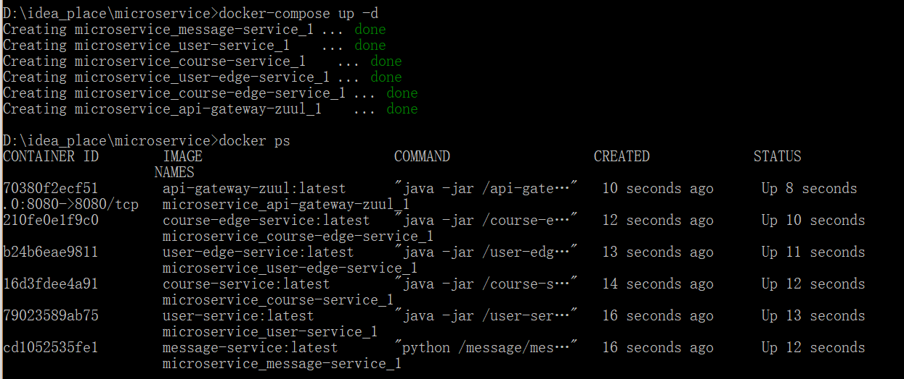

# Temp

跟着敲代码，实现部署效果。再逐个深入研究。

Thirft安装和验证

### 1.服务docker化  

##### user-thrift-service

M：docker运行，ip地址不固定怎么处理？

Z：使用参数的方式，在配置文件中添加

```properties
spring.datasource.url=jdbc:mysql://${mysql.address}/db_user
```

运行镜像的命令``docker run -it user-thrift-service:latest --mysql.address=192.168.0.2`` 即可指定变量。     

##### message-thrift-python-service

M：python怎么运行呢？

Z：首先拉取python所需的基础镜像

1.拉取   ``docker pull python:3.6``    

2.测试运行python   ``docker run -it --entrypoint bash python:3.6``   

M：但是这个docker只有python，没有thrift怎么办？

Z：在python基础镜像上面再构建一个基础镜像，加入thrift

```properties
FROM python:3.6
MAINTAINER xxx xxx@imooc.com

RUN pip install thrift
```

构建Dockerfile  ``docker build -t python-base:latest -f Dockerfile.base .`` 。使用构建好的镜像再构建镜像，拷入项目、执行命令。

```properties
FROM python-base:latest
MAINTAINER xxx xxx@imooc.com

ENV PYTHONPATH /
COPY message /message

ENTRYPOINT ["python", "/message/message_service.py"]
```

构建  ``docker build -t message-service:latest .`` 

M：怎么运行镜像呢？

Z：``docker run -it message-service:latest``  

##### user-edge-service

Z：构建和运行

1.首先构建镜像``docker build -t user-edge-service:latest .``

2.运行项目``docker run user-edge-service:latest --redis.address=127.0.0.1``  

##### course-dubbo-service  

Z：构建和运行

1.首先构建镜像``docker build -t course-service:latest .``

2.运行项目``docker run course-service:latest --redis.address=127.0.0.1``  

##### course-edge-service

##### api-gateway-zuul

``docker build -t gateway-zuul:latest .``

``docker run gateway-zuul:latest``  

M：构建完所有的镜像之后做什么呢？

Z：启动mysql，redis，zookeeper基础服务，配置docker-compose.yml并启动

### 2.docker-compose  

M：docker-compose有什么用呢？

Z：定义运行多个docker容器的工具。

M：docker-compose该怎么使用呢？

Z：编写命令，执行命令

```properties
version: '3'

#networks:
#  default:
#    external:
#      name: imooc-network

services:
  message-service:
    image: message-service:latest

  user-service:
    image: user-service:latest
    command:
    - "--mysql.address=127.0.0.1"

  user-edge-service:
    image: user-edge-service:latest
    links:
    - user-service
    - message-service
    command:
    - "--redis.address=127.0.0.1"

  course-service:
    image: course-service:latest
    links:
    - user-service
    command:
    - "--mysql.address=127.0.0.1"
    - "--zookeeper.address=127.0.0.1"

  course-edge-service:
    image: course-edge-service:latest
    links:
    - user-edge-service
    command:
    - "--zookeeper.address=127.0.0.1"

  api-gateway-zuul:
    image: api-gateway-zuul:latest
    links:
    - course-edge-service
    - user-edge-service
    ports:
    - 8080:8080
```

- 批量启动服务``docker-compose up -d``  

    

- 批量更新服务``docker-compose down``

### 3.测试访问   

运行命令汇总：

```
docker run -it user-service:latest --mysql.address=192.168.0.2
docker run -it user-edge-service:latset --redis.address=192.168.0.2
docker run -it course-service:latest --mysql.address=192.168.0.2 --zookeeper.address=192.168.0.2
docker run -it course-edge-service --zookeeper.address=192.168.0.2
docker run -it api-gateway-zuul
```

M：为什么访问不了呢？

Z：从头对比视频，并且做笔记总结，一直到知道为何访问不了为止


调整依赖

1. 数据库分表有什么规律吗？
2. ip的代替，名字访问和变量访问有什么区别呢？
3. docker-compose和普通启动有什么本质上的区别吗？


