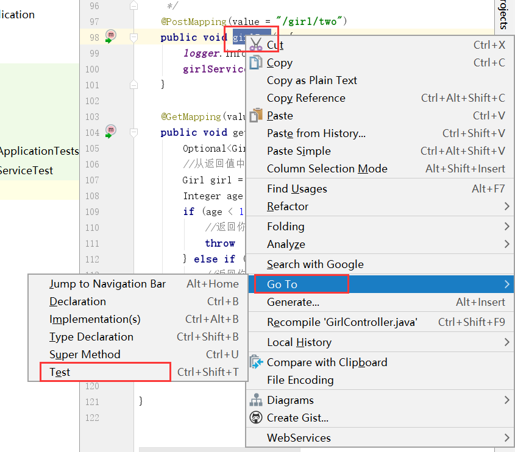
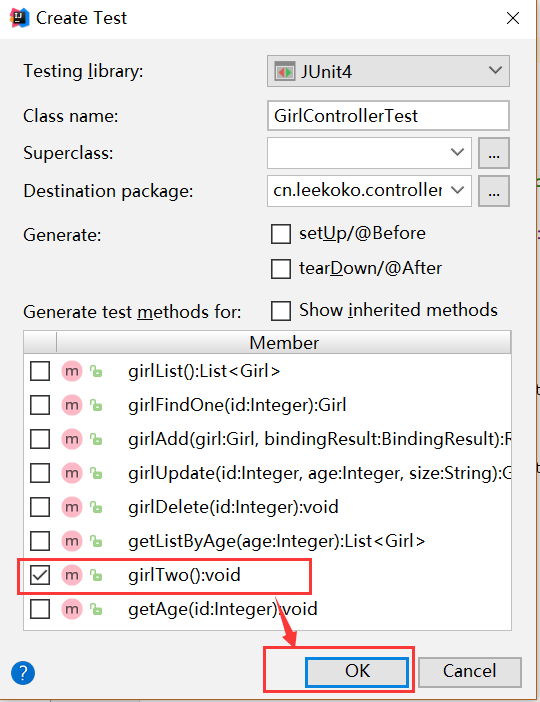

# SpringBoot进阶    

### 表单验证

M：我不想让一些不符合的数据插入数据库，前端控制虽然可以防止小白误操作，但是有意的黑客是可以很容易就绕过前端验证控制的，怎么在后台代码上验证数据呢？

Z：添加@Valid注解    

1. 首先将传值改为传对象，然后在对象前面添加@Valid注解。而BindingResult是用来存储报错信息的。

   ```java
       /**
        * 添加内容
        */
       @PostMapping(value = "/girlAdd")
       public Girl girlAdd(@Valid Girl girl, BindingResult bindingResult) {
           if(bindingResult.hasErrors()){
              //如果存在报错，输出报错信息
               System.out.println(bindingResult.getFieldError().getDefaultMessage());
               return null;
           }
           return girlRepository.save(girl);
       }
   ```

M：那怎么进行限制并报错呢？

Z：在``@Valid``的对象里面，``@Min``限定的是最小的值，如果小于value值，message值将写入BindingResult中。   

```java   
@Entity
public class Girl {

    @Id
    @GeneratedValue
    private Integer id;

    private String size;

    @Min(value = 18,message = "不到18不能进")
    private Integer age;
...
```

### Aop使用

M：怎么利用切面技术，在方法执行前面和后面添加日志打印呢？

Z：编写切面类，记住不能用Aspect文件，就算改成class也会导致切面功能失效。

```java
@Aspect
@Configuration
public class HttpAspect {

    private final static Logger logger = LoggerFactory.getLogger(HttpAspect.class);
        /*指定切面的对象*/
        @Pointcut("execution(public * cn.leekoko.controller.GirlController.*(..))")
        public void log(){
        }
        /*方法执行前执行*/
        @Before("log()")
        public void doBefore(){
            logger.info("1111111111111");
        }
        /*方法执行后执行*/
        @After("log()")
        public void doAfter(){
            logger.info("2222222222222");
        }
}
```

- ``@Aspect``作用是把当前类标识为一个切面供容器读取，指定这是一个切面
- ``@Configuration``即用来代替Spring配置文件的，它就是一个@Component组件。代表这个类是一个配置类。    

Z：添加这段切面代码之后，执行执行切面对象的代码时，切面代码就会切入到指定对象代码中，实现日志记录的功能。

### 接口规范   

M：我现在要做调用接口，但是每次返回的内容都不一样，怎么进行规范呢？

Z：定义一个规范的类，每次调用返回类的对应方法  

```java
public class ResultUtil {

    public static Result success(Object object){
        Result result = new Result();
        result.setCode(0);
        result.setMsg("成功");
        result.setData(object);
        return result;
    }

    public static Result success(){
        return success();
    }

    public static Result error(Integer code,String msg){
        Result result = new Result();
        result.setCode(code);
        result.setMsg(msg);
        return result;
    }

}
```

```java
    /**
     * 添加内容
     */
    @PostMapping(value = "/girlAdd")
    public Result<Girl> girlAdd(@Valid Girl girl, BindingResult bindingResult) {
        if(bindingResult.hasErrors()){
            return ResultUtil.error(1,bindingResult.getFieldError().getDefaultMessage());
        }
        return ResultUtil.success(girlRepository.save(girl));
    }
```

### 单元测试   

M：怎么测试Service呢？

Z：测试Service的方式:

1. 添加单元测试方法：右键被测方法，创建一个Test方法

     

   勾选要测的方法名，点ok即可快速创建单元测试   

       

2. 编写测试代码

   ```java
   @RunWith(SpringRunner.class)
   @SpringBootTest
   public class GirlServiceTest {

       @Autowired
       private GirlService girlService;

       @Test
       public void findOne(){
           Girl girl = girlService.girlFindOne(2);
           Assert.assertEquals(new Integer(15),girl.getAge());
       }
   }
   ```

3. 添加测试注解``@RunWith(SpringRunner.class)``和``@SpringBootTest``，``@Autowired``注入Service，后运行``@Test``测试  

M：那Controller是页面，也可以进行单元测试吗？

Z：也可以对api进行测试，需要再加一个注解``@AutoConfigureMockMvc``，使用mvc对象进行接口测试

```java
@RunWith(SpringRunner.class)
@SpringBootTest
@AutoConfigureMockMvc
public class GirlControllerTest {

    @Autowired
    private GirlService girlService;
    @Autowired
    private MockMvc mockMvc;

    @Test
    public void girlTwo() throws Exception {
        //返回状态码正确
        mockMvc.perform(MockMvcRequestBuilders.post("/girl/two"))
                .andExpect(MockMvcResultMatchers.status().isOk());
    }
}
```

也可以对返回的内容进行测试：

```java
mockMvc.perform(MockMvcRequestBuilders.post("/girl/two")).andExpect(MockMvcResultMatchers.status().isOk()).andExpect(MockMvcResultMatchers.content().string("abc"));    
```
[查看源码](../SourceCode/girl)      