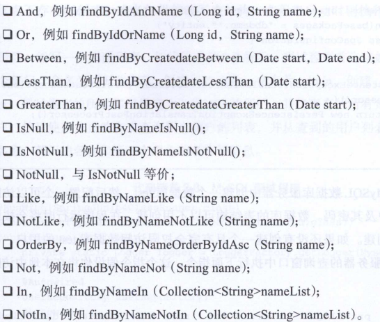

# spring data jpa

Z：jpa就是利用hibernate生成自动化的sql，直接通过代码调用。JPA可以将Java的普通对象关系映射持久化到数据库中。  

## 1.JPA环境  

M：想要使用JPA需要什么环境呢？

Z：如下步骤：

1. 引入maven

   ```xml
   <dependency>
       <groupId>org.springframework.boot</groupId>
       <artifactId>spring-boot-starter-data-jpa</artifactId>
   </dependency>
   
   <dependency>
       <groupId>mysql</groupId>
       <artifactId>mysql-connector-java</artifactId>
   </dependency>
   ```

2. application.yml配置数据库连接

   ```yaml
   spring:
     datasource:
       driver-class-name: com.mysql.jdbc.Driver
       url: jdbc:mysql://127.0.0.1:3306/test
       username: root
       password: 123456
     jpa:
       hibernate:
         ddl-auto: create
       show-sql: true
   ```

   - ``ddl-auto``
     - create:每次都重新创建数据库，数据不保存。使用create可以根据model创建数据库表。  
     - update:可以自动创建表，每次运行数据不会更新。如果表结构改变，不会删除原来的行，而是新增一列。 
     - validate：验证表结构和插入数据，不会创建新表。如果校验不通过，将启动失败。
   - ``show-sql: true``:控制台打印sql语句。   

## 2.Pojo编写

Z：JPA对POJO要求添加对应的注解，Demo如下

```java
@Entity
@Table(name = "deparment")
public class Deparment {
    @Id
    @GeneratedValue(strategy = GenerationType.IDENTITY)
    private Long id;
    
    private String name;
    
    @DateTimeFormat(pattern = "yyyy-MM-dd HH:mm:ss")
    private Date createDate;
    
    @ManyToOne
    @JoinColumn
    @JsonBackReference
    private Deparment deparment;

    @ManyToMany(cascade = {},fetch = FetchType.EAGER)
    @JoinTable(name = "user_role",
    	joinColumns = {@JoinColumn(name = "user_id")},
    	inverseJoinColumns = {@JoinColumn(name = "roles_id")})
    private List<Role> roles;
    
	...setter & getter方法
}
```

- @Entity：注明是实体类
- @Table(name = "deparment") ：  生成数据表名
- @Id ：指定唯一标识
- @GeneratedValue(strategy = GenerationType.IDENTITY)：设置为自动生成，生成策略为自增长。``GenerationType.Auto``为自动策略选择，假如数据库是Oracle，则选择Sequence。   
- @DateTimeFormat(pattern = "yyyy-MM-dd HH:mm:ss")：日期类型进行格式化
- @ManyToOne：与该对象是多对一关系
- @JsonBackReference：防止对象递归访问  
- @Transient：指定的字段不映射成列   
- @Column(nullable = false, unique = true)：设置列的非空和唯一性

M：JPA修改字段属性之后，怎么更新到数据库表中？

## 3.继承接口

Z：要使用APJ，需要1. 继承接口 2. 传实体类过去 3. 添加@Repository注解

```java
@Repository
public interface UserRepository extends JpaRepository<User,Long>{
}
```

通过接口可以直接调用dao层方法，JpaRepository的第二个参数表示ID的类型，这里是Long

## 4.JPA实现增删改查   

M：Controller使用接口的DEMO？

Z：注入接口，直接调用接口方法即可，如下

```java
    @Autowired
    private GirlRepository girlRepository;    
	
	/**
     * 查询所有
     * @return
     */
    @GetMapping(value = "/girls")
    public List<Girl> girlList() {
        return girlRepository.findAll();
    }
```

常见的默认方法有：

```
	userRepository.findAll();
	userRepository.findOne(1l);
	userRepository.save(user);
	userRepository.delete(user);
	userRepository.count();
	userRepository.exists(1l);
```

[查看源码](../SourceCode/girl)      

## 5.自定义查询

M：如果某些方法在JpaRepository中不存在呢？

Z：可以自己使用扩展方法，写在接口中，调用即可。但是要求方法名要规范

```java
public interface GirlRepository extends JpaRepository<Girl, Integer> {
    //通过年龄查询
    public List<Girl> findByAge(Integer age);
}
```

规范为`findXXBy`,`readAXXBy`,`queryXXBy`,`countXXBy`, `getXXBy`做为前缀，拼接属性（首字母大写），Demo如下：  

  

更多复杂查询点击[查看](http://www.ityouknow.com/springboot/2016/08/20/spring-boo-jpa.html)

## 6.分页查询

M：怎么实现分页查询呢？

Z：Demo如下

```java
    @RequestMapping(value="/listPage")
    public String listPage(){
        //分页查询	page，size，排序
        Pageable pageable = new PageRequest(0,10,new Sort(Sort.Direction.ASC,"id")); 
        Page<User> page = userRepository.findAll(pageable);
        String result = "";
        for (User user:page.getContent()){
            result = user.getName()+":"+user.getDeparment().getName()+":"+user.getRoles().get(0).getName();
        }
        return result;
    }
```
